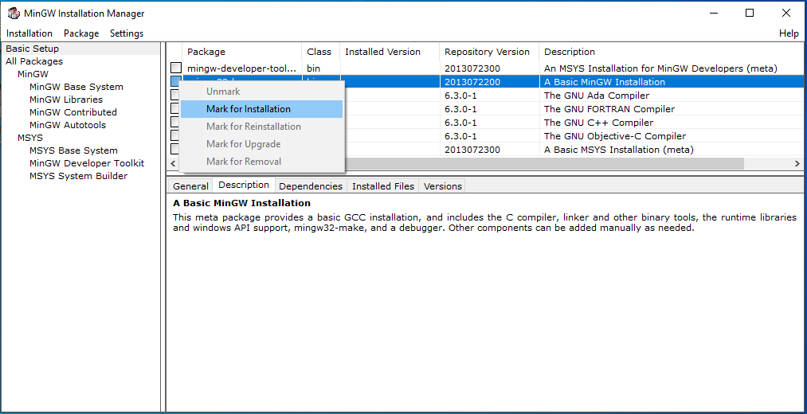

# Istruzioni per installazione software

Il seguente documento fornisce le istruzioni necessarie per installare gli strumenti di sviluppo utilizzati nel contesto del corso di Fondamenti di informatica.
La guida presenta le procedure di installazione e configurazione su Windows e MacOS X del compilatore GCC relativo editor di testo.

## Windows

### Installazione e configurazione MinGW

**MinGW** è il porting su Windows del compilatore GCC.

I passi per l'installazione sono i seguenti:

1. Scaricare l'installer dell'*Installation Manager* al seguente [link](https://sourceforge.net/projects/mingw/) attraverso il pulsante verde *Download*

1. Eseguire il programma di installazione
    * Accettare la licenza > Continue

    * attendere il completamento dell'installazione dell'*Installation Manager*, quindi Continue

1. Quando si apre la finestra di *MinGW Installation Manager* cliccare su `mingw32-base`

1. Selezionare la voce `Mark for Installation` come nell'immagine seguente 

1. Avviare l'installazione con Installation > Apply Changes 
    * Apply > attendere il completamento, quindi Close

Arrivati a questi punto abbiamo installato il compilatore GCC nel percorso `C:\MinGW\bin` (percorso di default).
Ora è necessario aggiungere tale percorso al `Path` di sistema in modo da poterlo usare da linea di comando, come segue:

1. Aprire il menù d'avvio e digitare **"Modifica variabili d'ambiente relative al sistema"**:

    

1. Cliccando su **Apri** Si aprirà la finestra "Proprietà del sistema":

    

1. Cliccando sul bottone **"Variabili d'ambiente"** si aprirà la finestra di dialogo, modificare la variabile `Path` (*quella più in basso!*), cliccando sul pulsante **"Modifica"**.

    

1. Alla lista di percorsi che apparirà, aggiungere la voce `C:\MinGW\bin`:

    

1. Premere su **"OK"** su tutte le finestre sin qui aperte per confermare le modifiche.

1. Per verificare la corretta configurazione aprire il prompt dei comandi ed eseguire `gcc`,
verificando che non appaia questo output
```
gcc: fatal error: no input files
compilation terminated.
```

### Installazione e configurazione Notepad++

Notepad++ è il nostro editor di testo dove scriveremo i nostri programmi C.

I passi per l'installazione sono i seguenti:

1. Scaricare l'installer al seguente [link](https://notepad-plus-plus.org/downloads/v7.9.3/) attraverso il pulsante verde *Download*

1. Eseguire l'installer
    * Ok > Accetto > Avanti > Avanti
    * Selezionare *Create Shortcut on Desktop*, quindi Installa
    * Avanti

## MacOS X

Su sistemi MacOS X è necessario installare il solo editor **XCode**, scaricabile dall'Apple Store.
